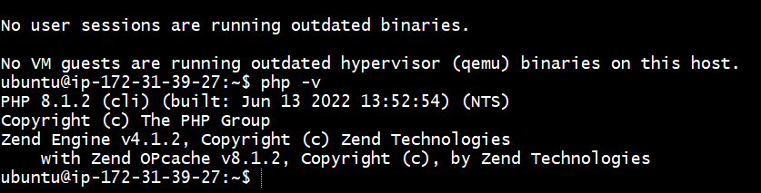

# Documentation for project 1

` Step 1 - installaing apcahed and updating firewall`

` # updating the list of package manager`

`sudo apt update`

`  installing apache2 package`

`sudo apt install apche2`

` # verifying apache2 is installed`

`sudo systemctl apache2`

` http://my-ip:80`

`  Step 2 - installing mysql`

` sudo apt install mysql-server -y `

` # loging into my sql database`

` sudo mysql `

` # setting mysql root passoword `

` ALTER USER 'root'@'localhost' IDENTIFIED WITH mysql_native_password BY 'PassWord.1'; `

` # starting interactive script `

` sudo mysql_secure_installation `

` # logging into mysql after setting root passowrd `

` sudo mysql -p `

` Step 3 - installing PHP,libapache2-mod-php and  php-mysql `

` sudo apt install php libapache2-mod-php php-mysql -y `

` # to check the php version `

` php -v ` 

` Step 4 - Virtual host for apache website `

` # creating projectlamp dir `

`sudo mkdir /var/www/projectlamp`

` # assigning owrnership to current user `

` sudo chown -R $USER:$USER /var/www/projectlamp `

` # creating a new config file called project.conf` 

` # enabling the virtual host `

` sudo a2ensite projectlamp `

` # disable the default host `

` sudo a2dissite 000-default `

` # checking for syntax error`

` # restarting apache2`

` sudo systemctl reload apache2 `

` # creating an indel file to test the web server `

` sudo echo 'Hello LAMP from hostname' $(curl -s http://169.254.169.254/latest/meta-data/public-hostname) 'with public IP' $(curl -s http://169.254.169.254/latest/meta-data/public-ipv4) > /var/www/projectlamp/index.html` 

` step 5 -- enabling php on the website `

` sudo vim /etc/apache2/mods-enabled/dir.conf `

` # restarting apache2 to load the new config `

` sudo systemctl reload apache2 `

` # creating a new test script for index.php `

`vim /var/www/projectlamp/index.php with this script below `

` <?php
phpinfo(); `

` removing the php file `

` sudo rm /var/www/projectlamp/index.php `

